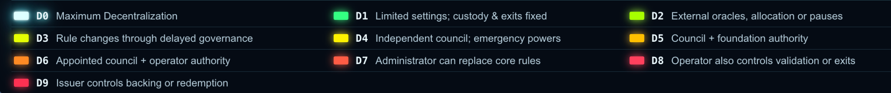

# Ethereum Decentralization Index

[](docs/images/decentralization-spectrum.png)

**EDI** helps explain who can change the rules of an Ethereum app or token, and who controls your ability to withdraw. It provides a shared D0–D9 scale, a portable data model and accessible React components for wallets, explorers and other apps. It was extracted from Map of Ethereum.

## The spectrum

| Grade | Meaning |
|---|---|
| D0 | Maximum Decentralization |
| D1 | Limited settings; custody & exits fixed |
| D2 | External oracles, allocation or pauses |
| D3 | Rule changes through delayed governance |
| D4 | Independent council; emergency powers |
| D5 | Council + foundation authority |
| D6 | Appointed council + operator authority |
| D7 | Administrator can replace core rules |
| D8 | Operator also controls validation or exits |
| D9 | Issuer controls backing or redemption |

The image opens at full resolution when clicked. The [versioned rubric](data/rubric.json) defines the scope and criteria for each grade. An incomplete review stays D? or shows a known floor such as ≥ D6.

## Installation

Source: [ryanberckmans/ethereum-decentralization-index](https://github.com/ryanberckmans/ethereum-decentralization-index). The package keeps `private: true` to prevent accidental npm publication. Install it as a Git dependency pinned to a full 40-character release commit. Branches and movable tags are not release pins.

## Entry points

```ts
import {assessment, composeAssessments, assessControlGraph} from 'ethereum-decentralization-index';
import {DecentralizationBadge, DecentralizationProvider} from 'ethereum-decentralization-index/react';
import 'ethereum-decentralization-index/styles.css';
```

The root entry is data-only: no React, browser globals, networking, storage or service credentials. Raw versioned data is available at `ethereum-decentralization-index/rubric.json`. The optional `/react` binding is inside the same package, so the rubric and UI cannot drift into incompatible package versions. React consumers provide React 19, React DOM 19 and Radix UI 1.6.7 or compatible versions; these are optional peers for core-only consumers.

## Core model

```ts
const token = assessment(0);
const network = assessment(6);
const app = assessment(null, {unresolved: ['Application deployment']});
const position = composeAssessments([token, network, app]);
// effectiveLevel: null; knownFloor: 6; status: 'partial'
// levelLabel(position) → '≥ D6'
```

`effectiveLevel` is a complete assessment only when every material dependency is reviewed. `knownFloor` preserves established restrictions. A known D0 baseline plus an unknown controller remains D?, rather than pretending to certify the unknown. Grades compose by maximum, never sum or average. `assessControlGraph(rootId, reviews)` follows explicit identity-based dependencies, detects cycles, bounds the graph, and keeps unresolved identities visible. A complete path's review date is its oldest component date when all components are dated.

Use `normalizeAssessment(untrustedValue)` when loading a saved assessment. Public descriptions, composition and React bindings normalize incoming assessments too: conflicting grades preserve the highest valid restriction, malformed or incomplete input cannot become a complete D0 assessment, and unsupported grades remain unknown.

D is an ordinal taxonomy of documented authority, not equal intervals, a probability of loss or a financial recommendation. D4 is not “twice” D2. Wallet custody is a separate assessment. Immutable code alone does not prove D0. The package includes the rubric and translations, **not a live oracle or automatically renewed project ratings**. Consumers supply reviewed, deployment-specific inputs.

## React components

| Component | Purpose |
|---|---|
| `DecentralizationProvider` | Shared guide, locale and System / Light / Dark theme; optional controlled state for host routing |
| `DecentralizationBadge` | D label, partial/unknown state, explanatory tooltip and keyboard/touch guide trigger |
| `DecentralizationSpectrum` | Compact interactive set of all ten grades |
| `DecentralizationLegend` | Responsive table of color, grade and meaning, with an optional first-row aside |
| `DecentralizationGuide` | Large plain-language guide, scope and dependency explanations, selected grade and safe evidence links |
| `DecentralizationCard` | Position-level explanation suitable for a wallet |
| `DecentralizationPath` | A readable sequence of the reviewed control dependencies |

Every badge works on its own; a provider shares one guide among many badges. Dialogs use Radix focus trapping and Escape/outside-click behavior, and return focus to the originating badge. For a guide opened directly from a URL, pass `returnFocusRef` to the host's chosen fallback control. The host owns routing: use controlled `guide` and `onGuideChange` to encode shareable state and Back/Forward behavior. Merely rendering the library never changes a URL or writes browser storage.

Standalone badges can appear inside a sentence. If placing a shared provider inside a paragraph, give it `inline` so its wrapper is valid phrasing content.

```tsx
<DecentralizationProvider theme="dark" locale="en">
  <DecentralizationBadge value={position} name="My ETH position" subject="position" />
</DecentralizationProvider>
```

Use `subject="ethereum-l1"` for Ethereum itself to show the special shared-foundation message. Other D0 mechanisms retain their scoped administrator/exit explanation. Eight locales ship: English, Simplified Chinese, Spanish, French, German, Brazilian Portuguese, Japanese and Korean.

The palette is fixed by grade: radiant cyan D0, green D1, then lime, gold and warm red. Unknown stays neutral. Color accompanies visible text and does not imply a moral or risk judgment. Styles are scoped to `edi-*`; tokens and layout can be adapted without importing the map's page shell. The compact table legend aligns color, grade and meaning, preserves horizontal spacing and draws subtle row dividers. Hover or keyboard focus shows a self-contained explanation; click or tap opens the full guide. It does not impose a viewport height or sticky position on a host application. Reduced-motion preferences are respected.

See `examples/WalletPosition.tsx` for a wallet integration. It uses illustrative inputs and makes their incomplete review visible.

## Develop and package

```sh
npm ci
npm test
npm run pack:check
npm pack
```

`npm run compile` produces ESM and declarations in `dist/`. Release commits include that output so Git consumers need no build scripts or development dependencies at install time. `npm run release:check` checks the generated output against source before publication. The data rubric and its compiled representation are checked for exact parity. Tests cover dependency composition, missing controls, cycles, bounds, dates, localization, source isolation, HTML escaping and badge affordances. Interactive browser verification remains necessary before adopting the components in a production wallet; this extraction has not been separately audited or browser-certified.

EDI owns the assessment semantics, rubric, palette, translations and components. Map of Ethereum consumes these exports at a fixed Git commit and maintains its own project reviews and financial accounting.

MIT; see LICENSE for the license terms and retained notices.
